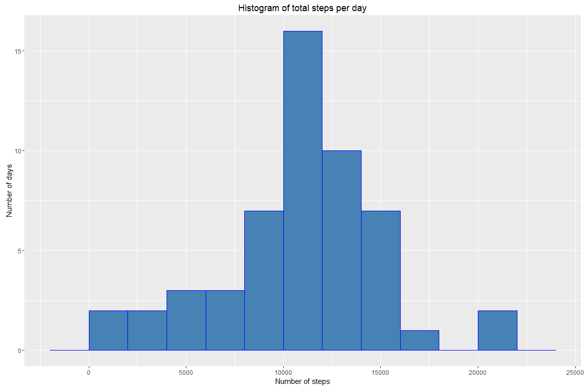
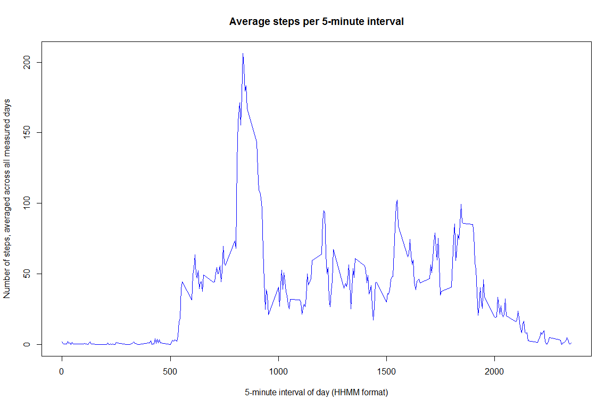
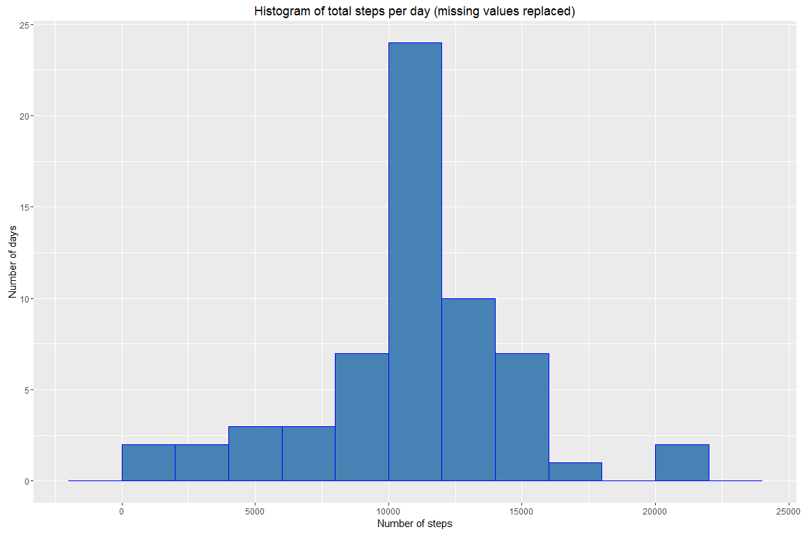
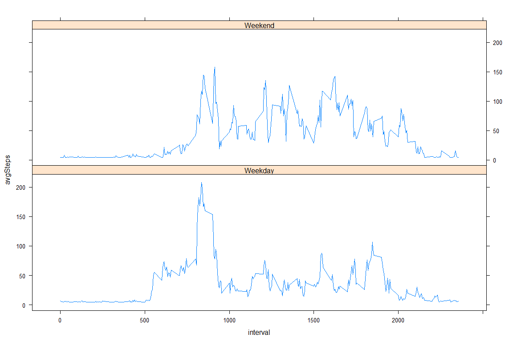

# Reproducible Research: Peer Assessment 1


## Loading and preprocessing the data, setting global options

```r
# unzip and read file
activityData <- read.csv(unz("activity.zip", "activity.csv"))

# format date as date
activityData$date <- as.Date(as.character(activityData$date))

# set global options
knitr::opts_chunk$set(fig.width=12, fig.height=8, fig.path="figure/", echo=TRUE)
```

## What is mean total number of steps taken per day?

```r
# load required libraries
library(dplyr)
```

```
## 
## Attaching package: 'dplyr'
```

```
## The following objects are masked from 'package:stats':
## 
##     filter, lag
```

```
## The following objects are masked from 'package:base':
## 
##     intersect, setdiff, setequal, union
```

```r
library(ggplot2)

# create daily summary
stepsPerDay <- (activityData %>%
                group_by(date) %>%
                na.omit %>%
                summarize(sum(steps))
                )
names(stepsPerDay) = c("date", "totalSteps")

# create histogram, showing how many days had a total step count within each 2000-step bucket
plot1 <- ggplot(stepsPerDay, aes(totalSteps))
plot1 + geom_histogram(binwidth = 2000, color = "blue", fill = "steel blue") + labs(title = "Histogram of total steps per day",
                                                                                    x = "Number of steps",
                                                                                    y = "Number of days")
```



```r
# calculate mean and median of the daily totals
meanSteps <- round(mean(stepsPerDay$totalSteps), 0)
medianSteps <- median(stepsPerDay$totalSteps)
```
The mean number of steps taken per day is 10766 (rounded to nearest whole number).  
The median number of steps taken per day is 10765.

## What is the average daily activity pattern?

```r
# create summary by interval
stepsPerInterval <- (activityData %>%
                     group_by(interval) %>%
                     na.omit %>%
                     summarize(mean(steps))
                     )
names(stepsPerInterval) = c("interval", "avgSteps")

# create time series plot
with(stepsPerInterval, plot(interval,
                            avgSteps,
                            type = "l",
                            col = "blue",
                            main = "Average steps per 5-minute interval",
                            xlab = "5-minute interval of day (HHMM format)",
                            ylab = "Number of steps, averaged across all measured days"
                            )
     )
```



```r
# determine interval with max avg step count
maxInterval <- stepsPerInterval$interval[which.max(stepsPerInterval$avgSteps)]
```
The interval with the greatest average number of steps across all the days in the dataset
is the interval from 835 to 840.  
(The interval above is expressed in HHMM format without leading zeroes.)

## Imputing missing values

```r
# using !complete.cases to find the # of rows with 1+ NA values
missingValues <- sum(!complete.cases(activityData$date, activityData$interval, activityData$steps))
```
There are 2304 missing values in the dataset.  
This analysis replaces missing values with the mean steps per interval for that same day.
For days that don't have a valid mean, the mean of the whole dataset is used.

```r
# calculate mean steps per interval for each day, which will replace NAs
# for days where the mean is NA or NaN, using the mean for the entire dataset
dailyMeans <- (activityData %>%
               group_by(date) %>%
               summarize(round(mean(steps, na.rm = TRUE),0))
               )
names(dailyMeans) = c("date", "meanStepsPerInterval")
dailyMeans$meanStepsPerInterval[is.na(dailyMeans$meanStepsPerInterval)] <- round(mean(activityData$steps, na.rm = TRUE), 0)

# create new data frame with NAs replaced by calculated means
imputedData <- activityData
for (n in 1:nrow(imputedData)) {
        if (is.na(imputedData$steps[n])) {
                imputedData$steps[n] <- dailyMeans$meanStepsPerInterval[match(imputedData$date[n], dailyMeans$date)]
        }
}

# create daily summary using new dataset
stepsPerDay2 <- (imputedData %>%
                 group_by(date) %>%
                 na.omit %>%
                 summarize(sum(steps))
                 )
names(stepsPerDay2) = c("date", "totalSteps")

# create histogram, showing how many days had a total step count within each 2000-step bucket
plot3 <- ggplot(stepsPerDay2, aes(totalSteps))
plot3 + geom_histogram(binwidth = 2000, color = "blue", fill = "steel blue") + labs(title = "Histogram of total steps per day (missing values replaced)",
                                                                                    x = "Number of steps",
                                                                                    y = "Number of days")
```



```r
# calculate mean and median of the daily totals
meanSteps2 <- round(mean(stepsPerDay2$totalSteps), 0)
medianSteps2 <- median(stepsPerDay2$totalSteps)
meanDiff <- meanSteps2 - meanSteps
medianDiff <- medianSteps2 - medianSteps
```
The new mean number of steps taken per day is 10752 (rounded to the nearest whole number).
This is a difference of about -14 from the first calculated mean.  
The new median number of steps taken per day is 10656.
This is a difference of -109 from the first calculated median.

## Are there differences in activity patterns between weekdays and weekends?

```r
# add factor variable indicating weekday vs weekend
imputedData <- mutate(imputedData, dayType = weekdays(date))
imputedData[imputedData$dayType %in% c("Monday", "Tuesday", "Wednesday", "Thursday", "Friday"), ]$dayType <- "Weekday"
imputedData[imputedData$dayType %in% c("Saturday", "Sunday"), ]$dayType <- "Weekend"
imputedData$dayType <- as.factor(imputedData$dayType)

# create summary by interval and weekend/weekday
stepsPerInterval2 <- (imputedData %>%
                      group_by(interval, dayType) %>%
                      na.omit %>%
                      summarize(mean(steps))
                      )
names(stepsPerInterval2) = c("interval", "dayType", "avgSteps")

# create panel plot with time series for weekend vs. weekday
library(lattice)
xyplot(avgSteps ~ interval | dayType, data = stepsPerInterval2, layout = c(1, 2), type = "l")
```


